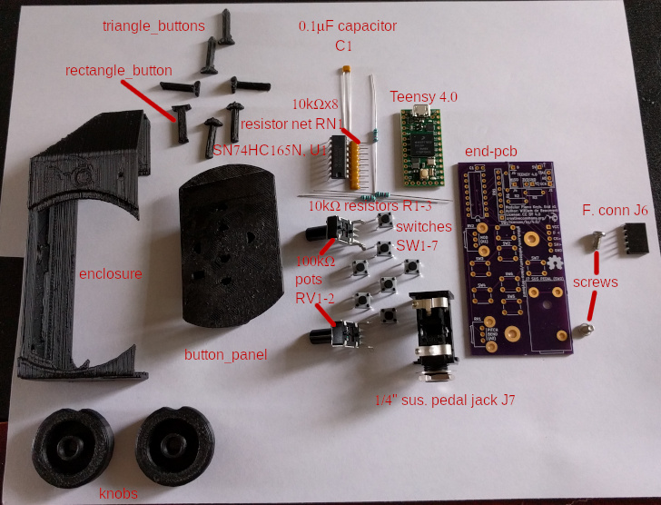

# Modular Piano Keyboard

## Octave Bill of Materials

Quantities shown here are for one octave (though you probably want to make at least 3).

### Printed plastic parts

| Ref. | Qty | Description |
|:---- | ---:|:---- |
| `support` | 1 | support for whole octave (or two halves below) |
| `support_low_half` | 1 | support for C-F keys |
| `support_high_half` | 1 | support for F♯-B keys |
| `black_key` | 4 | regular black keys |
| `key_a_sharp` | 1 | A♯ key |
| `key_c` | 1 | C key |
| `key_d` | 1 | D key |
| `key_e` | 1 | E key |
| `key_f` | 1 | F key |
| `key_g` | 1 | G key |
| `key_a` | 1 | A key |
| `key_b` | 1 | B key |

These total about 40cm3 of black plastic, 60cm3 of white plastic, and 50cm3 of additional plastic of any color (the color of the supports doesn't matter).

### Electronic components

| Ref. | Qty | Mfg. part no. | Digikey part no. | Description |
|:---- | ---:|:------------- |:---------------- |:----------- |
| U1-3 | 3 | SN74HC165N | 296-8251-5-ND | 8-bit PISO shift register |
| C1-3 | 3 | K104Z15Y5VF5TL2 | BC1160CD-ND | 0.1μF capacitor |
| RN1-3 | 3 | 4609X-101-103LF | 4609X-101-103LF-ND | 8×10kΩ bussed resistor array |
| R1 | 1 | RNF14FTD10K0 | RNF14FTD10K0CT-ND | 10kΩ resistor |
| J1 | 1 | PPTC051LGBN-RC | S5441-ND | 5-pin horiz. 0.1" pitch header, male |
| J2 | 1 | PRPC005SBAN-M71RC | S1111EC-05-ND | 5-pin horiz. 0.1" pitch header, female |

Note that many of these parts are shared between the octaves and the end piece, so you might want to take that into account when computing quantities to order. Even if you don't want to use the Teensy-based end piece, you might want to order 3 more resistors for the whole keyboard, so you can make the level shifter/voltage divider for connecting the 5V output of the keyboard to a 3.3V input on a Raspberry Pi or other microcontroller, as shown in `wiring.h`.

### Other parts and materials

| Qty | Description | How to get |
| ---:|:------------|:------------ |
| 12 | Bobby pin (metal) | Grocery store, hair care section, pack of 50, UPC 8 50899 00111 0 |
| 4 | M3 machine screw (length ~6mm) | Electronics/hardware store |
| 2 | Bamboo skewer (diameter 3mm, length >= 162.5mm) | Grocery store, barbecue section? pack of... many |
| 1 | Printed circuit board | OSH Park |
| ~30cm | Stranded copper wire | Cut from old telephone cord |
| ~60cm | 22 AWG solid copper wire | I got mine from Adafruit |
| 162.5×138.8mm | Corrugated cardboard | Cut from shipping boxes |
| 141 joints' worth | Solder | been using the same spool forever... |
| ~6 | Cotton swab | Grocery store, probably near the acetone |
| enough to soak the swabs | Acetone | Grocery store, nail care section ("nail polish remover") |
| ~16 drops | Superglue | Grocery store, housewares section |

## End Bill of Materials

Parts and quantities for one Teensy-based end piece.

### Printed plastic parts

| Ref. | Qty | Description |
|:---- | ---:|:---- |
| `enclosure` | 1 | main body of enclosure |
| `button_panel` | 1 | part of enclosure around buttons |
| `triangle_button` | 6 | button shafts for directional buttons |
| `rectangle_button` | 1 | button shaft for clear button |
| `knob` | 2 | pitch bend/modulation knobs |

These total about 30cm3 of plastic.

### Electronic components

| Ref. | Qty | Mfg. part no. | Digikey part no. | Description |
|:---- | ---:|:------------- |:---------------- |:----------- |
| J1-5 | 1 | DEV-15583 | 1568-DEV-15583-ND | Teensy 4.0 MCU board |
| U1 | 1 | SN74HC165N | 296-8251-5-ND | 8-bit PISO shift register |
| C1 | 1 | K104Z15Y5VF5TL2 | BC1160CD-ND | 0.1μF capacitor |
| RN1 | 1 | 4609X-101-103LF | 4609X-101-103LF-ND | 8×10kΩ bussed resistor array |
| R1-3 | 1 | RNF14FTD10K0 | RNF14FTD10K0CT-ND | 10kΩ resistor |
| RV1-2 | 2 | 09VR1M20F1N103B1 | CT3181-ND | 100kΩ potentiometer |
| SW1-7 | 7 | 1825910-6 | 450-1650-ND | SPST tactile pushbutton |
| J6 | 1 | PPTC051LGBN-RC | S5441-ND | 5-pin horiz. 0.1" pitch header, female |
| J7 | 1 | RA49B11 | SC2546-ND | 1/4" mono jack |

### Other parts and materials

| Qty | Description | How to get |
| ---:|:------------|:------------ |
| 2 | M3 machine screw (length ~6mm) | Electronics/hardware store |
| 1 | Bamboo skewer (diameter 3mm, length >= 30.5mm) | Grocery store, barbecue section? pack of... many |
| 1 | Printed circuit board | OSH Park |
| ~3cm | 22 AWG solid copper wire | I got mine from Adafruit |
| 42.4×109.3mm | Corrugated cardboard | Cut from shipping boxes |
| 94 joints' worth | Solder | been using the same spool forever... |
| ~5 drops | Superglue | Grocery store, housewares section |
