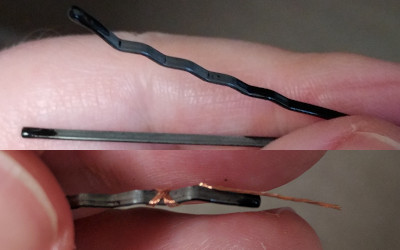

# Modular Piano Keyboard

## Octave Building Instructions

These are the building instructions for a single octave module of the modular piano keyboard. The instructions for the end piece that connects the octaves to a computer appear later in this document.

### Plastic Parts

The keys and their support structure can be printed on a 3D printer. Open `octave.scad` in [OpenSCAD](https://www.openscad.org/). By default this shows one assembled octave, including ghosts for the non-printed parts. You can also see a version with a cutaway in the C key to show how things fit together, by commenting out `assembled_octave();` and uncommenting `cutaway();`, at the end of the file.

You may need to adjust some parameters in the section labeled "parameters that depend on printer capabilities". I use an original [Printrbot](https://reprap.org/wiki/Printrbot), printing in ABS plastic onto blue painter's tape with a coating of ABS glue (made by dissolving waste ABS in a small amount of acetone to make it just gooey enough to spread). The Printrbot has a relatively small print bed (~ 124mm × 144mm, the white keys just barely fit), and printing in ABS onto tape means I have to worry a lot about prints curling up due to differential thermal contraction, especially with long thin pieces like piano keys. I also tend to have problems with close-fitting parts, solved with the `gap` parameter and a few others for specific situations. These issues are why I don't include my STL files here, only the original OpenSCAD file; you really should make your own STLs.

To show printable parts, comment out `assembled_octave();` and uncomment one line at a time from the "recommended printing order" section (make sure to read the comments there for more tips). You can then generate an STL file for each print (`Design` > `Render`, then `File` > `Export` > `Export as STL...`). I use Slic3r to generate gcode from the STL, with 20% fill density, and 2 solid layers on all sides.

Note that you have a couple of options for printing the black keys and the supports. I use the separate low and high halves for both, but if your printer is big enough and you're not worried about curling, you can try printing a whole octave at a time.

White keys are printed two at a time, again for space and curling reasons, but also because fit issues are likely to show up here. You wouldn't want to print a whole octave of white keys only to find out they don't quite fit on the supports and you have to adjust the parameters slightly. If you do in fact want to print a whole octave of white keys, you can try calling `plated_white_keys();` instead. If you are having curling issues, I don't recommend trying to print the white keys one at a time diagonally; I tried that a couple of times and had bad results.

You should be checking that the keys fit on their supports immediately after printing them, so that you can either make adjustments to the parameters, or just shave or sand them down to make them slide freely up and down. See "Attach keys" below. You should also check that the bobby pins fit in each slot before soldering them to the PCB. You might want to assign specific pins to specific slots in order to fine tune how the pins are bent, so that the white keys sit at the same height and require the same force to press.

Be careful when testing the bobby pins in their slots. They can shoot out suddenly, so keep a finger on them to prevent that, if it would stick a pin in your eye.

### Printed Circuit Board (PCB)

The circuit is designed in [KiCAD](https://kicad-pcb.org/). You can open the project file `octave-pcb/piano-keyboard-pcb-v2.pro` in KiCAD and use it to export Gerber files if you need to. I used [OSH Park](https://oshpark.com/)'s 2-layer prototype service, which accepts `.kicad_pcb` files directly. I got 3 copies of this board, unpopulated, for $44.45 delivered (this was by far the most expensive part, except for my own labor).

#### Solder components to the bottom

All the components on the PCB are through-hole soldered. Everything except for the switches (i.e. wires) goes on the bottom. I recommend leaving the switches for last, and doing everything else in order from thinnest to thickest:

 - Connectors J1-2. Do the male connector J1 first, while it's plugged into the female connector, to make sure there's enough space between the pins and the board. 
 - Resistor R1.
 - Chips U1-3. Note that these set the maximum height of the board.
 - Capacitors C1-3. These are about the same height; if not, bend them over a little.
 - Resistor networks RN1-3. These are slightly taller than the chips, but you can bend them over slightly before soldering. I recommend bending them away from the adjacent chips, so that the pins poking through the other side go towards the chips, and thus towards the middle of the key they're under. This should make them fit in the hollow in the bottom of the key when it's pressed. 

Cut off the excess leads from the resistor and capacitors, and optionally save them for later.

#### Make switches on the top

Make the switches from the bobby pins and wire, and solder them to the top side of the board (opposite all the other components):

 - Unbend the bobby pin slightly, so that it fits snugly in the slots in the support, and takes an appropriate amount of force to push down. If it doesn't go in all the way, try reaming out the slot with a drill bit to remove any extra blobs of plastic that may be interfering (especially from the top, where the bridging might have sagged into the slot). 
 - Remove any coating from the wavy (bottom) side of the bobby pin where you'll be soldering, and from the inside of the straight (top) side where the other wires will make contact when the switch is closed. You can do this with acetone and a cotton swab. Don't remove the coating from the bulbs on the ends or they'll fall off and leave you with a sharp edge. Also don't inhale the acetone.
 - Cut 2-3cm of uninsulated stranded copper wire and wrap one end around the wavy side of the bobby pin, with enough of the end of the wire hanging over the end of the pin so that you can poke it through the hole closest to the edge of the PCB. Solder the wire and the pin together where you wrapped it. 
 - Solder that wire into that hole, making sure that the bottom side of the bobby pin ends right about where the PCB begins (no overlap, maybe a 1mm gap). If the wire is too short, the pin won't go all the way into its slot; if it's too long, it will arch up and interfere with the other wires.
 - Strip the ends of a ~2cm piece of solid copper wire, and solder it into the middle hole. You can reuse the leads cut off of the resistor and capacitors for some of these.
 - Similarly use ~3.5cm of solid copper wire with the last hole. 
 - Bend the shorter, middle wire straight into the middle of the bobby pin, with the free end bent up a little.
 - Bend the longer wire away from the bobby pin, along the board, and then make a sharp U-shaped bend up and back towards the middle of the bobby pin, not as far as the shorter wire. Again, bend the free end up, a little less than the shorter wire.

The wire bending doesn't have to be perfect for now; save that for when the PCB is inserted into the plastic support. The goal is for the bobby pin, when pressed down, to make contact with the long wire first, and then the short wire. The U-bend in the long wire makes it so it can spring back instead of being permanently bent down when you first press the key.

Note that the C and G keys have screw holes near where the longer wire is soldered. The U-bend in the longer wires for these keys should just about touch the screw heads. In general the U-bends for all the keys need to be tight in order to avoid having the key push down on the wire there and make it lose contact with the bobby pin.

After you're finished soldering, it's a good idea to check for short circuits with a multimeter. At least check that VCC and ground aren't shorted before plugging it in.

### Final Assembly

At this point, you should be sure that all the keys fit on their supports and slide freely. But leave the keys off for the next step.

#### Insert PCB into support

Line up all the bobby pins in their slots in the support, and start pushing them in. If you printed the support in two halves, you can do this one half at a time to make it easier. Be careful not to break the stranded wires connecting the pins to the PCB. You can use the top of one of the white keys as a tool to push on the top sides of all the pins at once, to make them go in evenly. Be patient. Note that if the switch wires stick out of the bottom side of the board a little, they might catch on the part of the support under the PCB. You can wiggle the PCB up and down a little to get past this, and get the wires that stick out into the depressions for them in the PCB support struts. Push the bobby pins and PCB all the way in, so the back edge of the PCB is up against the front of the main part of the support.

You should be able to see the back of the pins through the holes in the backs of the support walls. If you need to undo this step later you can poke another pin through those holes from the back, to loosen the pins.

#### Secure supports and PCB

Insert the skewers in the two horizontal holes in the bottom of the support (now is a good time, especially if you printed the support in two halves). You should cut them to the same length as the octave, 162.5mm. Insert them so that the back skewer hangs out of the left side by 1cm, and the front skewer hangs out of the right side by 1cm. If they're loose, you can glue them in place later. If they're too tight to insert, check for plastic blobs inside the holes getting in the way and remove them with a knife and/or a drill. If there's nothing in the way, try flexing the support to straighten the holes as you insert the skewers.

Insert the four screws through the PCB and into the corresponding holes in the support. You might need to use some force when screwing them in for the first time, in order to cut the threads into the plastic. Do this on a surface you don't care about the finish of, just in case the screws poke out a little from the bottom of the support.

#### Check switches

Make sure the switch wires are bent properly (see PCB instructions above), since inserting the PCB into the support might have knocked them out of alignment. Look into the bobby pin slot from the front and press down on the top of the pin with your finger, so you can see if and when the wires make contact with the pin. You might also want to connect the electronics at this point so you can see when connections are being made that way. It will take some testing and iteration to get this right for each key. You can use an extra bobby pin or two as tools to help you adjust the positions of the wires while they are inside the support.

#### Attach keys

Slide each key onto its support wall, and then slide it forward until the hinge snaps into place. Attach the white keys first and then the black keys. The white keys are C through B, left to right. The black keys are all the same except for the rightmost one, A♯, which has a notch on the bottom right side to accommodate one of the screw heads.

If you printed the support in two halves, check that the F key doesn't noisily rub against the F♯ and G keys. If it does, try to wiggle the support halves around until it doesn't. Failing that, shave down the keys where they rub.

#### Attach cardboard

Cut a rectangular piece of corrugated cardboard, 162.5mm × 138.8mm (these measurements are `echo`'d by OpenSCAD when you show the default `assembled_octave();` scene). Cut it so that the corrugations run parallel to the keys (along the Y dimension). This cardboard helps the keyboard not to tip forward when you play chords, so you don't want it to fold up along the X dimension.

Turn the keyboard upside down and put a small amount of glue on each of the bottom surfaces (and on the skewers if they're still loose). Press the cardboard onto the glued surfaces, taking care to align the back corners of the support with the back corners of the cardboard. Turn the keyboard right side up again and let the glue set.

## End Building Instructions

These are the building instructions for the end piece that connects the chain of octaves to a computer as a USB MIDI device.

[TODO add photos]

### Plastic Parts

The plastic parts of the end can be printed from `end.scad`. You will need the enclosure (`plated_enclosure()`), the button panel (`plated_button_panel()`), two knobs (`knob()`), six triangular buttons, and one rectangular button (`buttons_plated()`). I recommend printing the enclosure and button panel in white, and the knobs and buttons in black, for contrast. You can use the `white_plated()` and `black_plated()` modules to make this easy. But the colors aren't super important here; I was running out of white, so I used black plastic for everything.

You can also view the `assembled_end()` module to see how the end should look when assembled, or animate the `exploded_end()` module to see how to put it together.

You might need to drill out the screw holes in the conical posts on the bottom of the button panel in order to get the screws to fit, since the 3D printer might have dragged the plastic around, or oozed too much plastic, making the holes smaller. The design tries to account for this, but it's not an exact science.

### Firmware

Open `teensy-usb-midi/teensy-usb-midi.ino` in the Arduino IDE software with [Teensyduino](https://www.pjrc.com/teensy/td_download.html) installed. Make sure that in the `Tools` menu, the `Board` is set to `Teensy 4.0`, and `USB Type` is set to `MIDI`. Click the checkmark button in the top left to verify the sketch. This will compile the program and pop up the `Teensy` window. Then push the button on the Teensy with it connected to the computer, which will cause it to download the newly compiled program. (It's easier to reach the button now, before assembly.)

### Printed Circuit Board (PCB)

Again, this is designed in KiCAD (open `end-pcb/piano-keyboard-end-pcb.pro`) and ordered from OSH Park (this time for $26.20 for 3 boards, though I only needed one).

All components except for the 5-pin female connector (J6) belong on the top side of the PCB; J6 goes on the bottom, matching the octaves.

#### Solder shorter components to the top

Solder the resistors R1-3, the resistor network RN1, the capacitor C1, and the chip U1 to the top of the board. Trim the leads from the resistors and the capacitor, and save them so you can use them for the next step.

#### Solder leads between Teensy and end PCB

Solder the saved leads to only the holes in the Teensy that have corresponding holes in the end PCB, in the area in the top right corner labeled `TEENSY 4.0`. Use a longer (~3cm) wire to connect the 5V hole in the top right of the Teensy to the extra hole in the end PCB labeled `5V`. All the leads should extend down from the bottom of the Teensy.

Insert the leads you just soldered to the Teensy into the corresponding holes in the end PCB. Then slide the two boards into the right side of the enclosure (see Final Assembly below) to get the spacing between the boards right. Solder two or three of the leads that are farther away from the plastic so you don't melt it. Then take the boards back out of the enclosure and finish soldering the rest of the leads.

#### Solder taller components to the top

The rest of the top-side components will clip into place. Because of that, they don't need to be supported from below, so you can insert them all now and solder them in one pass: switches SW1-7, potentiometers RV1-2, and the sustain pedal jack J7. The potentiometers might be a little loose; if so, solder them in place before inserting J7, and be careful about keeping them angled correctly. However, if they end up a little off-kilter, you can shave the holes their shafts are supposed to go through in the enclosure until they fit and turn freely.

#### Solder J6 to the bottom

Finally, solder the 5-pin female connector J6 to the bottom of the end PCB. The leads of the other components sticking out of the bottom will help support the PCB so that J6 is straight.

### Final Assembly

Viewing the animated version of `exploded_end();` might be helpful here.

 1. Slide the end PCB into the enclosure from the right side, so that the edges go into their slots around the three other sides, the potentiometer shafts go through their holes on the left side, and the sustain pedal jack and the Teensy's USB port slide into their slots on the bottom and the top, respectively. You can thread the nut that came with the sustain pedal jack onto it from the outside, to secure it further.
 2. Put the button panel into its hole in the top of the enclosure, so that the conical screw hole posts line up with the screw holes in the PCB, and screw in the two M3 screws from the bottom.
 3. Put the button shafts into the button panel. They should feel tight most of the way, and then pop into place. After that, you should be able to feel the click of the switches on the PCB when you push the buttons.
 4. Put the knobs onto the potentiometer shafts. If they're too loose to stay on, wrap a tiny bit of tape around the shafts to make the fit tighter.
 5. This is a good time to test that everything works properly, since the gluing steps may make disassembly more difficult (in particular, the cardboard covers the screws and makes them inaccessible). See [USAGE](USAGE.md).
 6. Cut and glue a 30.6mm piece of skewer into the groove just under the PCB where it connects to the Teensy. This should stick out of the right side by about 1cm, and it will go into the front skewer hole on the first octave when the keyboard is assembled.
 7. Cut a 42.4×109.3mm piece of the same corrugated cardboard that you used for the bottoms of the octaves, with a 45° bevel cut off of the top left corner, 22.1mm in from the top and left edges. (These dimensions are `echo`'d by OpenSCAD when you show the default `assembled_end();` scene.) Glue it to the bottom of the end enclosure.
