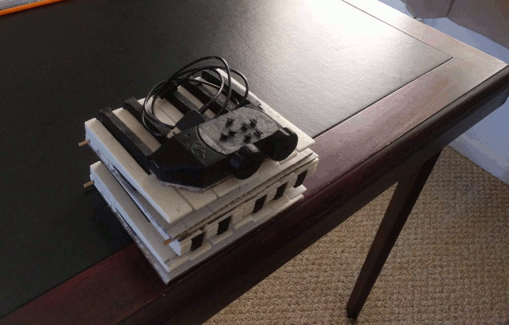

# Modular Piano Keyboard

By William de Beaumont

[CC BY 4.0](https://creativecommons.org/licenses/by/4.0/)

## Description

A DIY portable electronic piano keyboard with full-size keys, composed of several identical single-octave modules plugged together. Made using 3D printing, through-hole soldering, and easily obtainable parts.

Each key has two switches that close at different heights, in order to detect the velocity with which the key is pressed. Each octave (12 keys) has 3 8-bit shift registers that take input from the 24 switches in parallel, and shift output out serially, down towards the low (left) side of the keyboard.

That side may be connected to an end piece that uses a Teensy 4.0 to drive the shift registers and act as a USB MIDI controller. The end piece also has pitch bend and modulation wheels, a connection for a sustain pedal, and buttons to adjust a few settings.

Alternatively, you can connect that side of the keyboard to your own microcontroller, using an SPI port and one GPIO pin. The included `spi2midi` program will turn keypresses into MIDI commands on `stdout` if it is run on a Raspberry Pi connected to the keyboard as shown in [`wiring.h`](wiring.h).

## Instructions

 - [Bill of Materials](BOM.md)

 - [Building Instructions](BUILD.md) (many pictures)

 - [Usage Instructions](USAGE.md)

## Known issues

 - Sometimes with many octaves connected, the highest few keys don't trigger when you press them, and/or trigger at random, or when you press other keys. This seems to be mitigated somewhat by connecting an extra 10kΩ resistor between the clock and ground of the connector on the right side of the keyboard.

 - When you have 3 octaves connected, and hold any C key, the highest A key won't trigger when you press it (even with the resistor hack above). This also happens with C♯/A♯ and D/B. A, A♯, and B also happen to be the high keys that don't trigger without the resistor hack in this situation.

 - The key switches sometimes get out of alignment, preventing specific keys from triggering consistently until you take the key off and realign the switch.

 - The connection between the lowest octave and the end piece is a bit wobbly with only one alignment pin.

 - The pitch bend knob has no centering mechanism. I tried to make various kinds of springs for it, but the results were unsatisfying.

 - The hole in the end piece enclosure intended to let the LED on the Teensy shine through is too far away from it to matter. Maybe a light pipe would improve it. But as it is, the light shines out the right side anyway, so whatever.

## Future work

 - Better integration with ALSA MIDI ports on RasPi, ultimately letting it act as a standalone musical instrument by connecting to a soft synth.

 - Surface-mount version of octave PCB for mass production? Switches are still labor-intensive, though.
