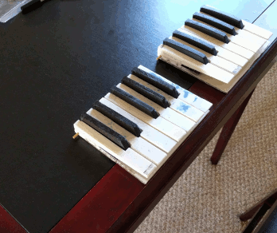

# Modular Piano Keyboard

By William de Beaumont

[CC BY 4.0](https://creativecommons.org/licenses/by/4.0/)

## Description

A DIY portable electronic piano keyboard with full-size keys, composed of several identical single-octave modules plugged together. Made using 3D printing, through-hole soldering, and easily obtainable parts.

Each key has two switches that close at different heights, in order to detect the velocity with which the key is pressed. Each octave (12 keys) has 3 8-bit shift registers that take input from the 24 switches in parallel, and shift output out serially, down towards the low (left) side of the keyboard. You can connect that end of the keyboard to a microcontroller, using an SPI port and one GPIO pin. The included `spi2midi` program will turn keypresses into MIDI commands on `stdout` if it is run on a Raspberry Pi connected to the keyboard as shown in [`wiring.h`](wiring.h).

## Instructions

 - [Bill of Materials](BOM.md)

 - [Building Instructions](BUILD.md)

 - [Usage Instructions](USAGE.md)

## Future work

 - Better integration with ALSA MIDI ports on RasPi, ultimately letting it act as a standalone musical instrument by connecting to a soft synth.

 - Code and PCB for connecting the keyboard to a Teensy 3.2/4.0 and having it identify itself as a USB MIDI controller. Include other controls e.g. octave selector, instrument selector, pedal, pitch bend/modulation wheels.

 - Surface-mount version of PCB for mass production? Switches are still labor-intensive, though.
